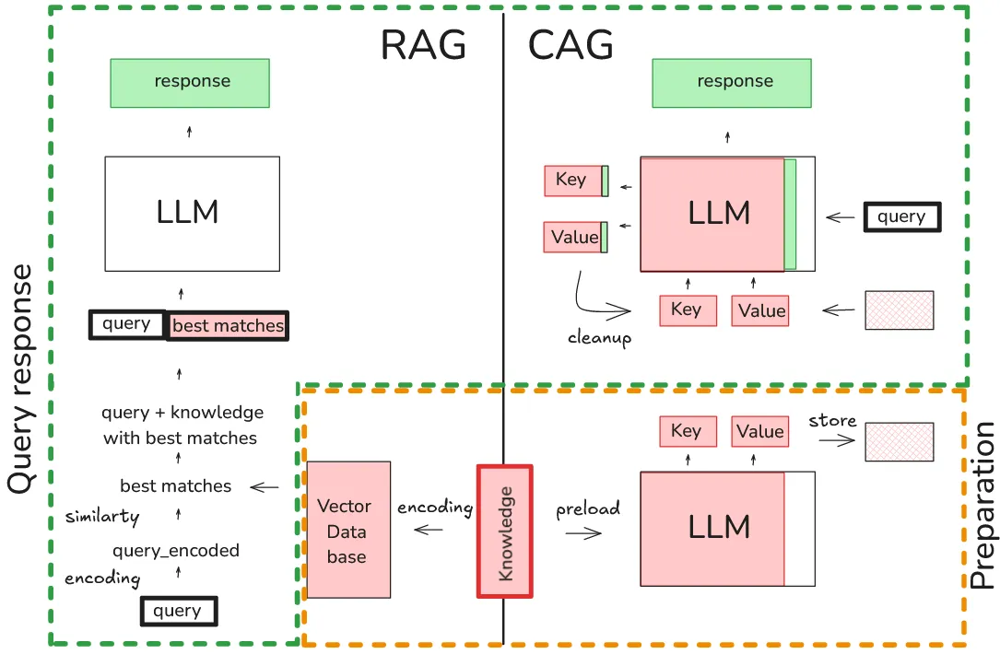

# Cache-Augmented Generation (CAG) with Mistral-7B


This repository demonstrates **Cache-Augmented Generation (CAG)** using the Mistral-7B model. CAG preloads relevant knowledge into a language model's context, enabling faster and more efficient question-answering without the need for real-time document retrieval. By leveraging dynamic caching, this approach allows for reusing the model's key-value states across queries, reducing the computational load for repeated questions.

## Requirements

- Python 3.7+
- PyTorch
- Hugging Face `transformers` library
- `bitsandbytes` for 4-bit quantization
- Hugging Face account with access to the mistralai/Mistral-7B-Instruct-v0.1 model

## Installation

1. Clone this repository:
   ```bash
   git clone https://github.com/shib1111111/Cache-Augmented-Generation.git
2. Navigate to the project directory:

    ```bash
    cd Cache-Augmented-Generation

3. Install the required packages or run code for that
4. Create a input_doc.txt file in the project directory, containing the knowledge you want to preload

# Usage

1. Open the `Cache Augmented Generation.ipynb` notebook in Jupyter, VS Code, or Google Colab.
2. Run the cells in order. The notebook will:
   - Load the Mistral model and tokenizer.
   - Read input file  and preload its content into a `DynamicCache`.
   - Ask two example questions about Ronan Takizawa, answering them using the cached knowledge.
   - Observe the model's responses, which are generated without real-time document retrieval.

# Customization

To use your own knowledge base:
1. Replace the content of input file with your desired information.
2. Adjust the example questions in the notebook to match your knowledge domain.
